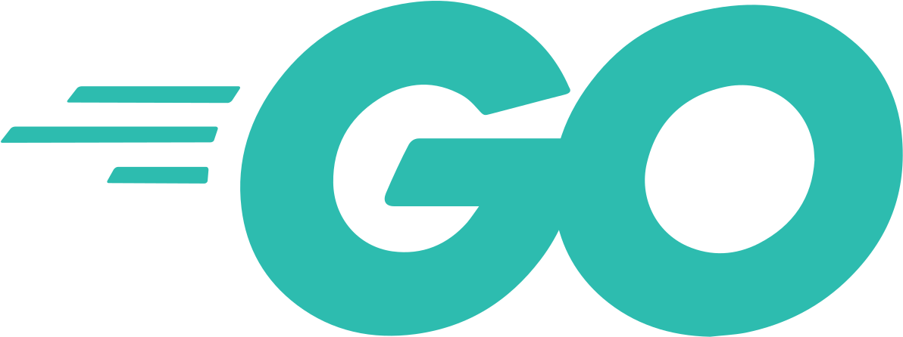

# 📘 Серия: Собирая пазл Go

  

## 📖 Меню

- 📜 [Изучение Go: установка, go toolchain, модули, пакеты и версии](docs/first-contact/index.md)
- 📜 [Изучение Go: документация как инструмент](docs/documentation-as-tool/index.md)
- 📜 [Изучение Go: спецификация — введение, нотация и исходный код + практика](docs/go-by-specification/1/index.md)
- 📜 [Изучение Go: разработка веб-приложений (обзор книги)](docs/web-applications-with-go-lets-go-book/index.md)
