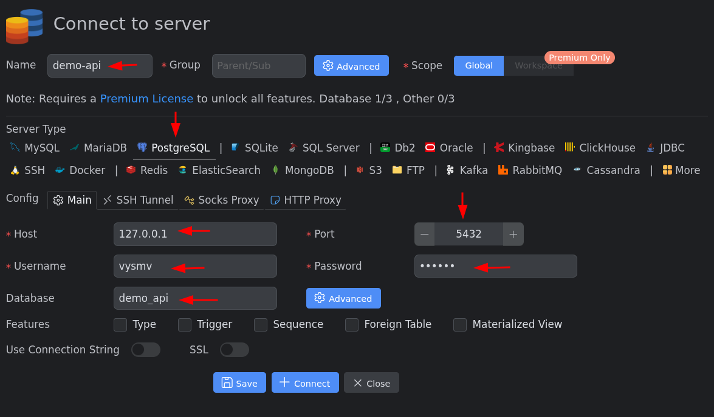

# Миграции

В этом блоке мы рассмотрим такую тему, как "миграции".

Давайте сразу переключимся на ветку `7-SQL-migrations`.

Если не уходить в дебри, то, по сути, миграции — это механизм, позволяющий зафиксировать последовательность изменений структуры базы данных и при необходимости воспроизвести ее на любой машине.

Допустим такую ситуацию:

Вы разрабатываете проект и, соответственно, создаете базу данных.

Например, вы создали пять таблиц, а затем за месяц внесли еще пять изменений в структуру базы в соответствии с обновленным ТЗ.

Далее к проекту подключились еще несколько программистов. Они склонировали проект и развернули у себя базу данных из созданного вами дампа.

Вроде бы все хорошо: все работают, и структура базы у всех синхронизирована.

Но затем оказывается, что заказчик снова изменил ТЗ и теперь нужно убрать два последних структурных изменения базы и внести еще три новых.

Вы выполняете эти изменения, но теперь возникает вопрос: **как эти изменения структуры базы должна получить остальная команда?**

Конечно, вы снова можете создать дамп базы, а остальные разработчики — пересоздать из него свои локальные базы. Но это приведет к тому, что каждый участник команды потеряет накопившиеся у него локальные данные.

Другой вариант — передать всей команде необходимые SQL-запросы, например `ALTER TABLE`, `DROP ...`, `CREATE ...` и т. д. Но здесь появляется другая проблема: эти запросы нужно выполнять каждому разработчику вручную и в правильном порядке.

Кто-то может забыть выполнить один из запросов, выполнить их в неправильном порядке или случайно выполнить один запрос дважды. В результате структура локальных баз у разных разработчиков может начать отличаться. И чем больше изменений и участников в команде, тем сложнее контролировать этот процесс.

Для систематизации и автоматизации таких изменений используются **миграции**.

Они позволяют пошагово фиксировать изменения структуры базы данных в специальных файлах. Эти файлы хранятся вместе с кодом проекта и попадают в коммиты.

Визуально это можно представить так:

```text
commit A
│
├── application code
└── migrations 001–003

commit B
│
├── application code
└── migrations 001–004

commit C
│
├── application code
└── migrations 001–005
```

Таким образом, вместе с новыми коммитами каждый разработчик получает и новые миграции.

После этого он может применить недостающие миграции к своей существующей базе данных. При этом инструмент миграций отслеживает, какие миграции уже были применены к конкретной базе, и выполняет только необходимые.

В результате разработчик, не теряя своих локальных данных, приводит структуру своей базы к актуальному для текущей версии проекта состоянию.

Для управления SQL-миграциями в этом проекте мы будем использовать инструмент командной строки `migrate`.

В первой части я показывал, что мы устанавливаем этот инструмент в `Dockefile` для контейнера `api`.

Давайте зайдем в контейнер и убедимся, что он установлен.

Выполним команду для входа в контейнер:

```bash
docker exec -it demo-api-api-1 bash
```

И после этого выполним команду для просмотра версии утилиты `migrate`:

```bash
migrate --version
```

## make и Makefile

Для управления утилитой `migrate`, которая, как мы только что увидели, установлена в контейнере, я решил использовать утилиту `make`.

В `Linux`-системах она очень распространена, но не обязательно установлена по умолчанию.

В `Linux` или `macOS` вы можете выполнить:

```bash
make --version
```

чтобы проверить, установлена она или нет.

Если не установлена, то загуглите, как ее установить в вашей системе.

> **Дополнительно**
>
> Тут стоит сделать небольшую ремарку для пользователей `Windows`.
>
> Для того чтобы команды, описанные в `Makefile`, корректно работали, я рекомендую использовать `WSL`, например, установить в нем `Ubuntu` и работать с в `Linux-окружении`.
>
> Это связано с тем, что наш `Makefile` использует `Unix-совместимый` `shell-синтаксис`. Поэтому, даже если установить утилиту `make` непосредственно в `Windows`, некоторые инструкции из `Makefile` могут приводить к ошибкам. Например, в нем могут использоваться такие `Unix-команды` и конструкции, как `rm`, `cat`, `mkdir -p` или `if [ ... ]`.
>
> Если вы используете `Docker Desktop` на домашнем компьютере, то наиболее вероятно, что `WSL 2` у вас уже установлен, поскольку именно он является рекомендуемым самим `Docker` способом запуска `Linux-контейнеров` на `Windows`. Случаи, в которых используется `Hyper-V`, я рассматривать не буду.
>
> Если вы не знаете, установлен ли у вас `WSL`, установлен ли в нем `Linux`-дистрибутив и что вообще с этим делать, то откройте текстовую версию видео, перейдите в текущую тему "Настройка и конфигурирование базы данных" и найдите там ссылку — [Ubuntu WSL](./wsl.md).
>
> Там будет небольшая инструкция и некоторые дополнительные пояснения.

Так вот, чтобы использовать утилиту `make`, нужно создать специальный файл — `Makefile` и в нем определить некие имена команд и описать действия, которые должны выполняться по факту вызова этих команд.

Давайте посмотрим на наш `Makefile`.

Тут есть двенадцать обособленных смысловых блоков:

1. **`.DEFAULT_GOAL := migrate-help`** — задает команду по умолчанию, которая выполнится при запуске `make` без аргументов.

2. **`.PHONY`** — объявляет перечисленные цели фиктивными (phony targets). Такие цели не представляют файлы и выполняются независимо от наличия одноимённого файла в текущей рабочей директории.

3. **`SERVICE=api`** — переменная с именем `Docker Compose` сервиса, в котором выполняются команды.

4. **`migrate-help`** — выводит список всех доступных команд и примеры их использования.

5. **`migrate-create`** — создает новую пару файлов миграции (`up` и `down`) с указанным именем.

6. **`migrate-up`** — применяет все еще не выполненные миграции к базе данных.

7. **`migrate-version`** — показывает текущую версию миграций базы данных.

8. **`migrate-goto`** — переводит базу данных к указанной версии миграций (вперед или назад).

9. **`migrate-down`** — откатывает миграции. Если указан параметр `N`, откатывает только указанное количество миграций, иначе откатывает все.

10. **`migrate-force`** — принудительно устанавливает указанную версию миграций без выполнения SQL-запросов. Используется для исправления состояния миграций.

11. **`backup`** — создает резервную копию данных базы данных в файл `docker/postgres/backup/latest.sql`. Это не связано с миграциями, а просто дополнительный функционал.

12. **`restore`** — восстанавливает данные из файла `docker/postgres/backup/latest.sql` в базу данных. Это также не связано с миграциями.

Итак, как результат, у нас в контейнере есть утилита, реализующая механизм работы миграций, `migrate` и есть `Makefile`, в котором есть короткие имена для сложных действий.

При помощи этих команд я уже создал необходимые текущему состоянию проекта файлы миграции и выполнил их.

Сейчас мы посмотрим на сами файлы миграции, которые я создал, а потом, в разделе «Резюме», мы ещё раз вернёмся к командам, чтобы сформировать чуть более подробную картину того, как ими пользоваться.

## /Migrations

На данный момент тут есть четыре файла, то есть две пары.

Давайте посмотрим на их содержание:

* `000001_create_movies_table.up.sql` — содержит `SQL`-запрос на создание таблицы `movies`.
  Обратите внимание, что поля и типы этой таблицы соответствуют полям и типам структуры `Movie`, которую мы создали ранее.
  Это важно, потому что позволит нам легко сопоставлять данные каждой строки таблицы `movies` с одной структурой `Movie` в нашем `Go-коде`.

* Столбец `id` настроен как первичный ключ таблицы.

* Столбец `genres` — это массив из нуля или более текстовых значений.

* Также везде, где это возможно, устанавливаем `NOT NULL`. Это избавляет от некоторых проблем в будущем.

* Для хранения строк мы используем тип `text`.

* `000001_create_movies_table.down.sql` — содержит `SQL`-запрос для удаления таблицы `movies`.
  То есть, как я и говорил ранее, в каждой паре файлов есть запрос для действия и отмены этого действия.

А теперь давайте посмотрим на вторую пару.
И хотя мы могли бы не разделять эти действия на два отдельных шага, а просто выполнять несколько `SQL`-запросов
в первой паре файлов, я решил оставить разделение, чтобы более явно выразить идею миграций.

* `000002_add_movies_check_constraints.up.sql` — содержит проверки `CHECK`, которые будут обеспечивать соблюдение некоторых наших бизнес-правил на уровне базы данных. В частности, мы хотим убедиться, что:

  * значение `runtime` всегда больше нуля;
  * значение `year` находится в диапазоне от 1888 до текущего года;
  * массив `genres` всегда содержит от 1 до 5 элементов.

* `000002_add_movies_check_constraints.down.sql` — содержит запрос на удаление этих изменений.

## Резюме

Если подвести итог, то получается такая картина.
Если нам нужно создать новую таблицу или модифицировать имеющуюся, мы выполняем команду:

(Слайд №2)

```bash
make migrate-create NAME=create_name_table
```

Это приведет к появлению пары файлов.
В файле `up` мы пишем запрос на создание/модификацию.
В файле `down` мы пишем запрос, отменяющий действие.

Далее мы можем выполнить созданную миграцию. При этом миграций может быть несколько: мы можем создать две, три и более пар файлов с изменениями, а затем выполнить их все вместе. Для этого запустим команду:

(Слайд №3)
```bash
make migrate-up
```

Но также не стоит забывать, что все невыполненные миграции запустятся автоматически при выполнении:
```bash
docker compose up
```

В первом видео мы разбирали файл `docker/entrypoint.sh`. Так вот, там есть проверка наличия файлов с миграциями, и, если они есть, запускается утилита `migrate`. Она выполнит все миграции, которые ещё не выполнялись.

Для того чтобы отслеживать, какие миграции уже были применены, утилита `migrate` автоматически создает таблицу `schema_migrations`.
Давайте на нее посмотрим.

В поле `version` хранится номер последней успешно примененной миграции.

Например, если `version` = 2, это означает, что были успешно выполнены миграции:

* 000001_...
* 000002_...

Далее вы можете, к примеру, посмотреть текущую версию миграции либо напрямую в таблице, либо выполнив команду:

(Слайд №4)
```bash
make migrate-version
```

Также можете откатить все миграции, выполнив:

(Слайд №5)
```bash
make migrate-down
```
То есть эта команда приведёт к тому, что выполнятся все `down`-файлы. 

Или, как вариант, можете выполнить команду:

(Слайд №6)
```bash
make migrate-goto VERSION=1
```
Это отменит все миграции до первой. То есть останутся изменения только те, которые вы делаете в миграции `000001_...`

И также отдельно от темы миграции вы можете выполнять команду:

(Слайд №7)
```bash
make backup
```
Это приведет к тому, что появится файл бэкапа в `docker/postgres/backup`.
Это удобно, если вы что-то нахимичили и хотите сохранить данные из БД, чтобы не создавать их по новой.
А после того, как все удалите и создадите новые контейнеры, то просто выполняете:

(Слайд №8)
```bash
make restore
```

Это приведет к восстановлению данных из бэкапа.

Перед тем как идти дальше, рекомендую вам самостоятельно поиграться с миграциями, если тема для вас новая. Это позволит лучше понять, как это работает.

Выполните, к примеру, следующие действия:

1. Создайте новую пару файлов.
2. Напишите там код для создания таблицы и ее удаления.
3. Запустите миграцию самостоятельно и проверить изменения в базе.
4. Попробуйте откатиться на одну версию назад и проверить изменения в базе.
5. Откатитесь полностью назад, проверьте изменения в базе, а потом, оставив только две пары миграций из этого блока, выполните пересборку проекта и проверьте, выполнились ли они автоматически.
   Ну или выполните те манипуляции, которые придумали вы.

Состояние изменений вы можете смотреть либо, как я, через расширение `VS Code` `MySQL Database Client` (должно быть первым в списке), либо в контейнере через консольный клиент.

Если вы будете использовать расширение, но не знаете, как его настроить, то посмотрите в текстовой версии этого видео скрин с настройками.

<p align="center">

<p/>

На этом я завершу эту часть.

И, как обычно, не забывайте ставить лайк, подписываться на YouTube и Telegram, если тема вам интересна и хочется увидеть продолжение.

Ну а сейчас всем спасибо за просмотр и пока!
 
