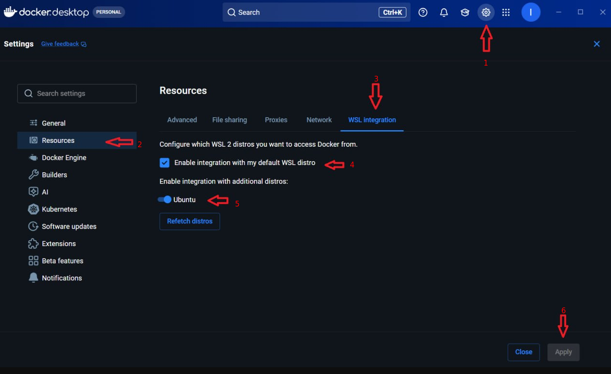

# Настройка работы через `WSL`

Я исхожу из того, что у вас установлен `Docker desktop` и `WSL` по [инструкции с официального сайта](https://docs.docker.com/desktop/setup/install/windows-install/).

А значит, сейчас нам нужно только ответить на вопрос, установлен ли уже дистрибутив `Linux`.

Выполните команду в `PowerShell`:
```text
wsl --list --verbose
```

Если вы увидите имя дистрибутива, например `Ubuntu` 
```text
  NAME              STATE           VERSION
* Ubuntu            Running         2
  docker-desktop    Running         2
  ```
то значит, необходимый нам `Linux-дистрибутив` уже установлен.
Если увидите только `docker-desktop`, то значит, нужно установить дистрибутив.
Первым делом вы можете посмотреть список доступных дистрибутивов:
```text
wsl --list --online
```

Наиболее комфортным для новичка будет дистрибутив `Ubuntu`.
Для его установки выполните команду:
```text
wsl --install -d Ubuntu
```

При первом запуске `Ubuntu` будет выполнена первоначальная настройка и предложено создать `Linux-пользователя` и пароль.
После завершения установки у вас должен открыться терминал, подключенный к установленному в `WSL` дистрибутиву `Ubuntu`.
Если не открылся, то выполните команду в `PowerShell`:
```text
wsl -d Ubuntu
```

В открывшемся терминале необходимо выполнить:
```bash
make --version
```

чтобы проверить, установлена утилита или нет.

Если не установлена, то выполните:

```bash
sudo apt update
sudo apt install make
```

Для завершения настройки вам необходимо активировать ваш дистрибутив `Docker Desktop`.

Как это сделать, показано на следующем скрине:

<p align="center">

<p/>

Также нужно добавить вашего пользователя в группу `docker`.
Для этого выполните следующие команды:

1. В терминале `Ubuntu`:

```bash
sudo usermod -aG docker $USER
```

Потом:

```bash
exit
```

2. В `PowerShell`:

```text
wsl --shutdown
```

Потом:

```text
wsl -d Ubuntu
```

Это основные действия, которые необходимо было сделать для настройки.


## Ментальная модель для новичков

Теперь давайте построим очень упрощенную ментальную модель.

Установка дистрибутива `Linux` в `WSL` — это что-то похожее по смыслу на установку дистрибутива в `VirtualBox`.
Технически устройство отличается от обычной `VM` в `VirtualBox`, но как ментальная модель сейчас это вполне подходит.

В общем, для вашего дистрибутива создается виртуальный диск, и там есть обычная файловая система `Linux`:
```text
/
├── bin
├── etc
├── home
│   └── your-name
├── usr
├── var
└── ...
```

При стандартной установке данные дистрибутива обычно хранятся на системном диске `Windows`. При необходимости расположение дистрибутива можно изменить.
Если, к примеру, вы создали проект `demo-api` где-то в `D:\projects\demo-api`, то вы можете получить к нему доступ из установленной `Ubuntu`.
Представим, что вы открыли терминал с `Ubuntu`, и если вы посмотрите содержание каталога `mnt`, то увидите там директории ваших дисков на `Windows`:

```text
C:\ → /mnt/c
D:\ → /mnt/d
E:\ → /mnt/e
```

Это значит, что вы можете перейти в ваш проект, выполнив:
```bash
cd /mnt/d/projects/demo-api
```

То есть теперь вы можете работать с вашим проектом, который физически лежит в директории `D:\projects\demo-api` на `Windows-хосте`, в `Linux` окружении, а значит, теперь вы можете использовать необходимые нам `Unix-команды` и `shell-синтаксис`, который используется в `Makefile`.
Как альтернатива, вы можете вообще сразу создавать проекты уже внутри `Ubuntu`.
То есть создать, например, директорию `/home/your-name/project/` и клонировать проекты уже туда.
В этом случае ваши проекты будут уже полностью внутри `Linux` системы.
Визуально это можно представить так:
```text
Вариант A

Windows:
D:\projects\demo-api

WSL:
/mnt/d/projects/demo-api

        ↑
это одни и те же файлы
```

```text
Вариант B

WSL:
/home/your-name/projects/demo-api

        ↑
проект находится
в Linux-файловой системе WSL
```

> Для активной разработки через `WSL` обычно рекомендуют второй вариант — держать Linux-проекты в файловой системе `WSL`.

Далее давайте внесем ясность в то, что касается управления `Docker Engine`.

Давайте сначала посмотрим на **Вариант A**, то есть когда файлы лежат в `D:\projects\demo-api`.
Вы также можете управлять вашими контейнерами через `Docker Desktop GUI` на `Windows-хосте` или выполнять команды `Docker CLI` из `PowerShell`, но вы также можете управлять им и из `WSL`.

```text
                    Docker Desktop GUI
                            │
                            ▼
PowerShell ───────────► Docker Engine ◄─────────── WSL
                            │
                            │
                      ┌─────┴─────┐
                      ▼           ▼
                     api       postgres
```

Если же мы рассматриваем **Вариант B**, то есть когда проект лежит в файловой системе `Ubuntu`, то вы также сможете управлять им из `Docker Desktop GUI` на `Windows-хосте` или из `WSL` (то есть внутри `Ubuntu`). Управление через `PowerShell` также будет доступно, но нужно использовать специальные пути, чтобы обращаться к файловой системе `WSL`, например `\\wsl.localhost\Ubuntu\home\your-name\projects\demo-api`, если команде необходим доступ к файлам проекта. Хотя такой вариант и не является предпочтительным, я его упоминаю просто для демонстрации технической возможности.

Это имеет значение прежде всего для команд, которым необходим доступ к файлам проекта. Например, `docker compose up` по умолчанию ищет `Compose-файл` относительно текущей директории.
Команды вроде `docker ps`, которым файлы проекта не нужны, можно выполнять как из `PowerShell`, так и из `WSL`, не переходя при этом в директорию проекта.

## Примечание

Если вы создаете проект внутри файловой системы `WSL`, то вы также можете писать код, используя `Vs code`.
Для этого перейдите в директорию вашего проекта:
```bash
cd /home/your-name/projects/demo-api
```

и там запустите:
```bash
 code .
```

При первом выполнении команды `code .` начнется установка служебного компонента `VS Code Server` внутрь вашего `Linux-дистрибутива`. После завершения установки откроется `VS Code`, установленный на `Windows`.
`VS Code` предложит установить расширение, необходимое для полноценной работы с `WSL`. Установите его.
Это позволит максимально удобно, находясь визуально на `Windows-хосте`, вести разработку проекта в `Linux-окружении`.


